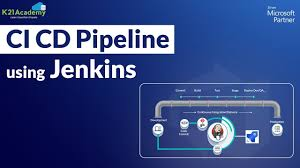
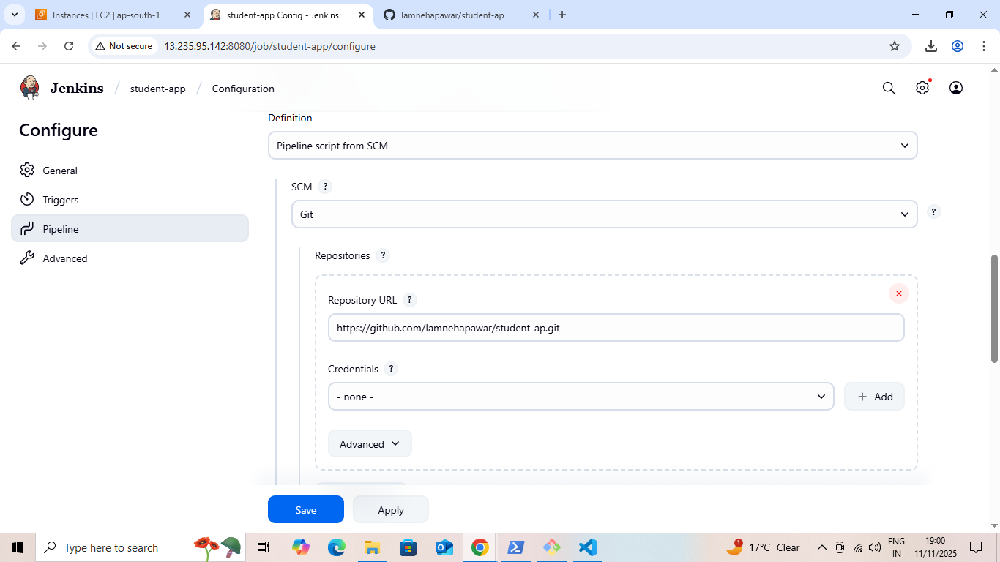
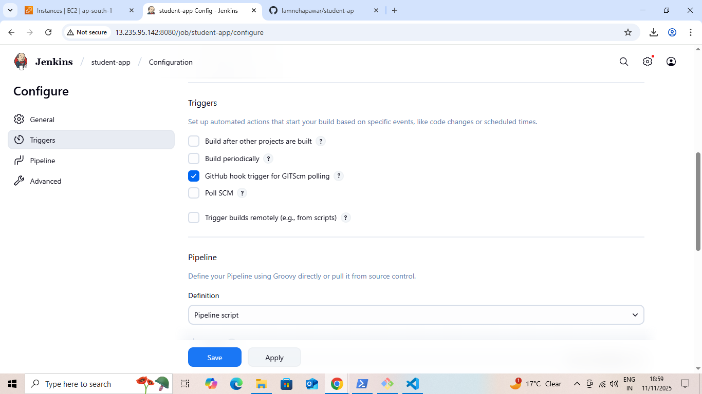

# Java Student Management Application with Automated CI/CD

This project is a **Java-based Student Management Web Application** deployed using a fully automated CI/CD pipeline. It uses **Git, GitHub, Jenkins, Maven, AWS EC2, and Apache Tomcat** for automatic deployment.

---

## Project Overview

The application allows users to manage student details:

- Name  
- Address  
- Age  
- Qualification  
- Percentage  
- Year of Passing  

It demonstrates a **full CI/CD workflow**, automating deployment from GitHub to AWS EC2.

---

## Project Objectives

The pipeline automates:

- Pulling the latest code from GitHub  
- Building the project using Maven  
- Creating a deployable `.war` file  
- Transferring the `.war` file to a Tomcat server on EC2  
- Restarting Tomcat to deploy the latest version  
- Making the application accessible in a browser  

---

## Tools & Technologies

| Category              | Tool / Technology              |
|-----------------------|-------------------------------|
| Programming Language  | Java                          |
| Build Tool            | Maven                         |
| Version Control       | Git & GitHub                  |
| CI/CD Automation      | Jenkins                       |
| Cloud Platform        | AWS EC2 (Ubuntu)              |
| Application Server    | Apache Tomcat 10              |
| Pipeline Type         | Jenkins Declarative Pipeline  |

---

## EC2 Setup

Two EC2 instances are used:

| Instance  | Purpose             | Configuration                         |
|-----------|-------------------|---------------------------------------|
| EC2-1     | Jenkins Server     | Ubuntu 22.04, Jenkins, Java, Maven, Git |
| EC2-2     | Application Server | Ubuntu 22.04, Apache Tomcat 10, Java |

**Screenshots: EC2 setup**

---

## CI/CD Pipeline

### 1. GitHub Repository Push
Shows the code commit/push that triggers the pipeline.

### 2. Jenkins Pipeline Trigger
Pipeline starts automatically after code push.

### 3. Jenkins Console Output
Shows the build/package/deploy logs.

---

## Application Output

After deployment, the application displays a **Student Admission Form** with fields for:

- Student Name  
- Address  
- Age  
- Qualification  
- Percentage  
- Year Passed  

**Screenshots: Student Form**

---

## Deployment Summary

- CI/CD pipeline ensures **automatic deployment** on every Git push  
- Deployment is smooth and requires **no manual intervention**  
- Application runs successfully on **Tomcat 10 hosted on AWS EC2**

### Author
Name: Neha Pawar  
GitHub: [Iamnehapawar] (https://github.com/Iamnehapawar/student-app-repo.git)